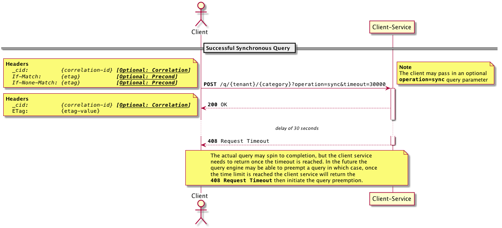

# Asynchronous Requests - NOT IMPLEMENTED / REFERENCE DOCUMENTATION FOR FUTURE IMPLEMENTATION ONLY

The client service supports a wide range of asynchronous models.

#### Eva ETag Specification

There are times when a query needs to know if the database state is at a particular value or not. This can make
sure that duplicates (though eva can prevent these), known states are either avoided or otherwise processed. This
is the main motivation for this construct. For this state management, the `ETag` http concept is borrowed.

> ETag Format: `<schema>=<payload>`

The schema is a label used to identify the payload so that future versions may be able to change according to
new models and information. Currently only the `EET1` schema is available.

##### `EET1` Payload Specification

The Eva ETag Version 1 specification is a schema for the `ETag` value used to identify the temporal version the
database is at. The payload is a base64 encoded JSON structure with the following members:

| Value | Description
|-------|-------------
| `t`   | The database `T` value Client-Service must deliver this.

###### Example:

For a `t` value of `1234` the following JSON structure is defined:

```JSON
{
  "t": 1234
}
```

which will be converted to base64 as such:
```
ewogICJ0IjogMTIzNAp9
```

resulting in the `ETag` value of: 
```
EET1=ewogICJ0IjogMTIzNAp9
```

> Note that whitespace can add to the value of the base64 payload. For example the following is equivalent:
`EET1=eyJ0IjoxMjM0fQ==`

## Synchronous Mode

To understand the asynchronous models, we first must understand the synchronous model. This model is simplistic
and only has a limited set of possible responses.

#### Request Options
* `timeout` query parameter returns after the duration specified with a timeout `408 Request Timeout` if the
  query has not returned yet. The timeout unit will be in milliseconds and have a default of `30000`.
* `operation` query parameter set to `sync`. This is not required for the synchronous operation as this is the
  default mode of operation.
* Optional `_cid` Header is the correlation id and if not provided the system will generate a uuid.
* Optional `If-Match` and `If-None-Match` Headers can be used to check if the state of the system is at a specific
  value. The `etag-value` is tied to the eva `t` notion making this an equivalent to a version check.
  
#### Response Specification
* If the `_cid` Header was specified in the request, then the response will return the same header and value.
* The `ETag` header will be returned with the `etag-value` of the current `t` value.

### Sequence Diagram for Synchronous Queries



## Polling and Ranging Modes

The polling and paging modes akin to each other and only have slight variations. In general, this method is used
by systems that long running queries where the requester is the one that needs the data. For systems that do not
require the results to go directly back to the requester or systems where the data would ultimately need to be
transported to another service, see the [Forwarding](#Forwarding).

### Polling Model

To initiate this mode, the requester service needs to supply the `operation=polling` query parameter. This mode
will then start the query process, returning a `202 Accepted` status unless an error was encountered. Like the
Synchronous Mode, the `_cid`, `If-Match`, and `If-None-Match` headers can be supplied and work the same way.

The primary use case for this mode is to allow the query engine to collect all results without the worry of a
timeout occurring.

#### Request Options

To control the connection status, the following headers are allowable and follow the well established http rules
supplied for them.

| Header | Value
|--------|-------
| `Connection` | `keep-alive` 
| `Keep-Alive` | `timeout=<timeout-value>, max=<max-value>`

where the `<timeout-value>` and `<max-value>` follow the [http rules](https://developer.mozilla.org/en-US/docs/Web/HTTP/Headers/Keep-Alive).

#### Response Specification

There are two main concepts: The `Location` header, and the body of the response.

For links that are returned, the locations should not be fully qualified and return only the path - not machine name.
This is because the service may not know the service endpoint but the network topology should automatically resolve this.
Furthermore, the requesting service should have this information without a special configuration.

The response `Expires` header allow for the client to know when the query will be terminated if no action is taken, and
the `Retry-After` header tells the client a reasonable time in seconds that the client can come back to the service and
request an update. Note that the `Retry-After` header value is a suggestion and not enforced. That said, it will allow 
the client service to fairly notify the larger system of it's load. The `Age` response header may also be returned to
indicate how long this query has already taken to run. It is anticipated tha the first result will be `0`, but all other
responses will give a general indication on the number of seconds that have passed since the start of the query.

##### `Location` header

The location header will return the path to the location of the query results. Though the results may not be complete yet,
this location should still satisfy the results of the query, status of `200 OK`, or return a status of `204 No Content`.

##### Body

The initial response for this mode is a JSON document with a link to the location of the status of the running
query. This status will give the status of the query, not the result of it. In the future, this should also allow for
controlling the query (for example preempting the query).

```JSON
{
    "links": [{
        "rel": "status",
        "href": "/check/{tenant}/{category}/{token}"
    }]
}
```

> Note that the `links` collection is a set of object for possible future extensions.

#### Status response

As the name suggests, the `status` endpoint can be queried for statuses on the query. These statuses can be cached
and queried after the request has been satisfied.

## Ranging Mode

The ranging mode is analogous to paging or partial results. This mode allows the requesting system to receive partial
blocks of results so that it can more easily process the data. Furthermore this mode can better handle resources
due to the ability to abandon or terminate the query once the needed values are returned.

#### Request Options

For this operation, use the `operation=range` query parameter. Also, the `Accept-Ranges` and `Range` headers are used.

> Note: For the `Accept-Range` header, only `entries` is valid as an option.

Like the polling mode, the `_cid`, `If-Match`, `If-None-Match`, `Connection`, and `Keep-Alive` headers are
also available as described above.

#### Response Specification

The response from the ranging mode will follow the same pattern as the polling mode with the following inclusions:

* The `Content-Length` header will return the number of entries this payload returned.
* The `Content-Range` header follows the same definition as http, but the unit will be `entries` as defined above.
 
 > Note for`Content-Range` the parameter will be the range followed by a `*` or a number. This symbol `*` will indicate
 the full range isn't known or a number will be the size of the total query result. Example: unknown size
 `entries=0-99/*`, or Range of 100 items `entries=0-99/100`.

### Sequence Diagram for Asynchronous Polling and Ranging Queries


## Forwarding Mode

Unlike the polling or ranging mode, the forwarding mode does not respond through the same channel as the request. This
is a truer asynchronous model. The client service is required to know where to send the response, assuming that the
proper security and configuration is set, this mode will forward the query to a channel. Various different destination
types will have implementations not known to the client service, so a plugin to that implementation will need to be
created and configured. The assumption here is that the plugin will be its own JAR for that specific destination.

#### Request Options

Like the other asychronous modes, the `operation` query parameter need to be set, in this case to `forward`. A new query
parameter `destination` will also need to be set with a destination alias defined in the configuration. Finally
`propagation` query parameter may optionally be set to control what is communicated to the channel.

> Note: only the `_cid`, `If-Match`, and `If-None-Match` headers are available in this mode.

#### Response Specification

The success response to the requesting service is simply a `202 Accepted` with the status payload described above. The
response to the recieving channel is defined by the plugin that is configured.


